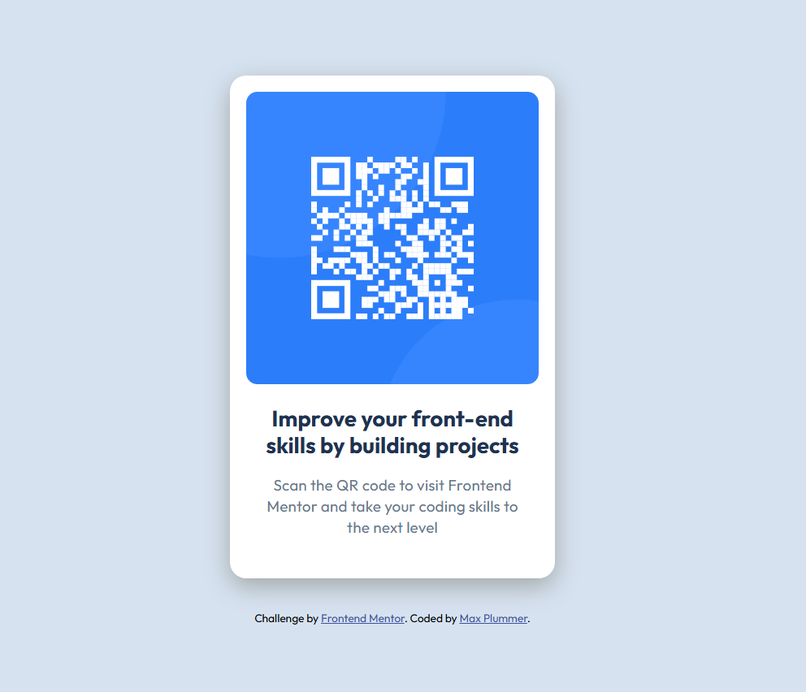

# Frontend Mentor - QR code component solution

This is a solution to the [QR code component challenge on Frontend Mentor](https://www.frontendmentor.io/challenges/qr-code-component-iux_sIO_H). Frontend Mentor challenges help you improve your coding skills by building realistic projects. 

## Table of contents

- [Overview](#overview)
  - [Screenshot](#screenshot)
  - [Links](#links)
- [My process](#my-process)
  - [Built with](#built-with)
  - [What I learned](#what-i-learned)
  - [Useful resources](#useful-resources)
- [Author](#author)

## Overview

### Screenshot



### Links

- Solution URL: https://github.com/MaxPlummer/qr-code-component
- Live Site URL: https://maxplummer.github.io/qr-code-component/

## My process

### Built with

- Semantic HTML5 markup
- CSS custom properties
- Flexbox
- Mobile-first workflow

### What I learned

I learned much about implementing a flexbox layout in this project. Displaying content with flex to create a vertical stack of elements produced a clean layout for the QR code component. 

```css
display: flex;
flex-direction: column;
justify-content: center;
align-items: center;
```

### Useful resources

- [Google Fonts](https://fonts.google.com/) - This is where the font used in this project comes from. I toyed around with different fonts and was able to see how they looked with different sizes and such through the preview. I plan to use this site in future projects to find more fonts. 

## Author

- Github - [MaxPlummer](https://github.com/MaxPlummer)
